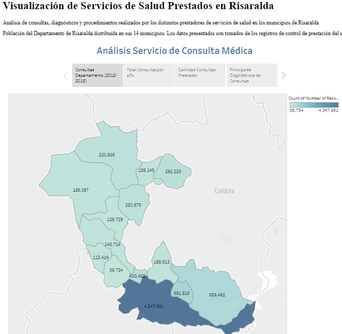

# Visualización Consultas y Procedimientos Médicas del Departamento de Risaralda años 2012-2015

## Objetivo
Analizar el comportamiento de los servicios de salud prestados tanto de consulta como de procedimientos a la población del departamento de Risaralda, perteniente a los regímenes contributivo y subsidiado, con el fin de gestionar políticas de salud pública en el departamento.

## Tecnologías Usadas
Como herramienta de visualización se utilizó el software Tableau y como repositorio del proyecto se usó la plataforma GitHub

## Prerrequisitos
Para visualizar el proyecto se requiere de un navegador web

## Marco de Análisis Visual 
#### (What) Datos: Bases de datos:
- RIPS (Registro Individual de Prestación de Servicios de Salud)
- REPS (Registro Especial Prestadores de Servicios de Salud)

#### (Why) Tareas: 
- Conocer los diagnósticos más frecuentes en el departamento, es decir, de qué se enferma la población Risaraldense
- Conocer los procedimientos más comunes realizados por los distintos prestadores
- llevar un registro especial los servicios que presten los prestadores de servicios de salud
- Determinar la capacidad de servicios de las entidades prestadoras der servicios de salud

#### (How) Usuarios: 
Tomadores de decisiones de la Secretaria de Salud del Departamento de Risaralda

## Autores
Deisy Salazar Parra

## Enlace 

https://deisysalazar22.github.io/visualizacion-consultas-risaralda/

## License

See the [LICENSE](LICENSE) file (MIT).

